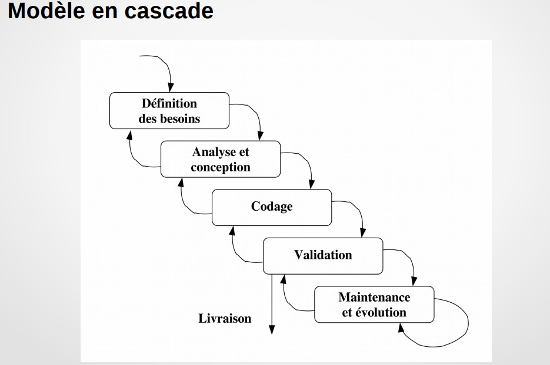
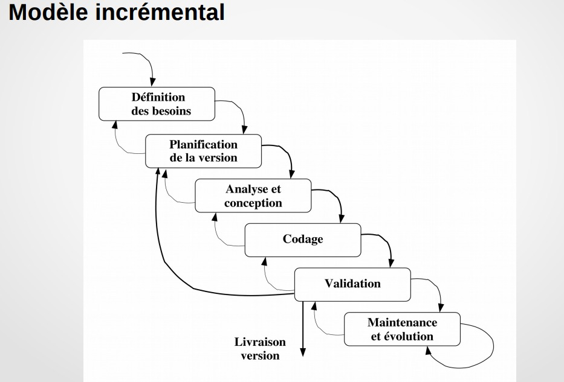
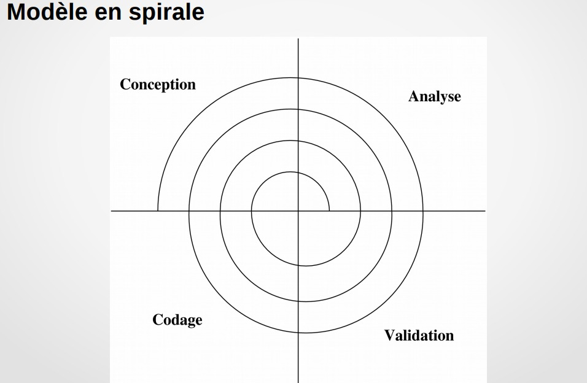

# cour 01 : **Introduction à la conception de logicielle**

## 1.  **Introduction:**

>**La conception logicielle** est le processus qui consiste à transformer les exigences fonctionnelles spécifiées lors de l'analyse des besoins en une structure logicielle bien organisée. Cela implique de prendre des décisions architecturales et de concevoir des modules, des composants et des interfaces de manière à répondre aux spécifications tout en garantissant la qualité, la maintenabilité et la facilité d'évolution du logiciel.

- Les principales étapes de la conception logicielle comprennent :

    1. **Analyse des Besoins :** Comprendre les besoins des utilisateurs et définir les fonctionnalités attendues du logiciel.
    
    2. **Conception Architecturale :** Définir l'architecture globale du système, identifier les composants principaux et décrire leurs interactions.
    
    3. **Conception Détaillée :** Élaborer les spécifications détaillées de chaque composant, définir les interfaces, et planifier la structure interne de chaque module.
    
    4. **Modularité et Réutilisation :** Favoriser la modularité en divisant le système en composants autonomes, promouvoir la réutilisation du code pour améliorer l'efficacité et la qualité du développement.
    
    5. **Modélisation :** Utiliser des modèles et des diagrammes (comme les diagrammes de classe, de séquence, et de flux) pour représenter visuellement l'architecture et le fonctionnement du logiciel.
    
    6. **Testabilité :** Concevoir le logiciel de manière à faciliter la création de tests efficaces pour garantir la qualité du produit final.

La conception logicielle peut être influencée par divers paradigmes de développement, tels que la programmation orientée objet, la programmation fonctionnelle, ou d'autres méthodologies spécifiques. L'objectif global est de créer une solution logicielle qui répond de manière élégante et efficace aux besoins spécifiés, tout en facilitant la maintenance et l'évolution futures du logiciel.

la conception logicielle est un aspect crucial du génie logiciel qui permet de traduire les exigences en une architecture et une structure de logiciel bien conçues, favorisant ainsi le développement de systèmes informatiques de haute qualité.

## 2. **Etapes du cycle de vie du logiciel:**

Le cycle de vie du logiciel (CVL) représente les différentes phases à travers lesquelles un logiciel passe depuis sa conception initiale jusqu'à sa maintenance. Ces phases sont structurées pour organiser et guider le processus de développement logiciel. Les modèles de cycle de vie peuvent varier en fonction des méthodologies et des approches spécifiques utilisées dans le génie logiciel, mais voici une description générale des étapes courantes du cycle de vie du logiciel :

1. **Analyse des Besoins :**
   - Cette phase implique la collecte et l'analyse des besoins du client et des utilisateurs finaux. Les spécifications fonctionnelles et non fonctionnelles du logiciel sont définies.

   - à la sortie de cette phase on a :  **cahier des charges** , **étude de faisabilité**.

2. **Conception :**
   - Pendant cette étape, l'architecture du logiciel est conçue. Les concepteurs créent des modèles détaillés du système, identifiant les composants, les modules et leurs interactions.
   
   - à la sortie de cette phase on a : 
        - **spécification (description des fonctionnalités)**
        - **conception architecturale (structure)**
        - **conception détaillée (composants, algorithmes)**

3. **Implémentation (ou Codage) :**
   - C'est la phase où le code source est écrit en utilisant les langages de programmation appropriés. Les développeurs suivent les spécifications de conception pour créer les fonctionnalités du logiciel.

4. **Validation(Tests) :**
   - Les tests sont effectués pour s'assurer que le logiciel répond aux spécifications définies. Cela inclut des tests unitaires, des tests d'intégration et des tests systèmes.
   
   - La validation s'assure que le logiciel répond aux besoins du client, tandis que la vérification vérifie que le logiciel a été développé conformément aux spécifications.

5. **Livraison et Déploiement :**
   - Le logiciel est livré au client et déployé dans l'environnement prévu. Cela peut inclure des phases pilotes et des mises en production progressives.

6. **Maintenance :**
   - Après le déploiement, le logiciel nécessite des mises à jour, des correctifs de bugs et des améliorations. La maintenance peut être corrective, adaptative, évolutive ou préventive : 
        - **maintenance corrective** (correction d’erreurs)
        - **maintenance adaptative** (portage du logiciel)
        - **maintenance évolutive** (évolution du logiciel)

>Il est important de noter que différents modèles de cycle de vie, tels que le modèle en **cascade**, le modèle en **V**, le modèle **itératif**, ou le modèle **agile**, peuvent organiser ces étapes de manière différente en fonction des besoins du projet et des préférences de développement. Chacun de ces modèles a ses avantages et ses inconvénients, et le choix dépend souvent des caractéristiques spécifiques du projet et des préférences de l'équipe de développement.

#### RQ :

- Place de la maintenance : ``développement initial : 20 %``  , ``maintenance : 80 %``

- Place de la mise en œuvre : ``analyse et conception : 40 %``  , ``programmation : 20 %``  , ``validation : 40 %``

## 3. **Modèles du cycle de vie du logiciel:**

Il existe plusieurs modèles de cycle de vie du logiciel, chacun ayant ses propres caractéristiques, avantages et inconvénients. Le choix d'un modèle dépend souvent des besoins spécifiques du projet, des ressources disponibles et des préférences de l'équipe de développement. 

### 3.1 **Modèle en Cascade :**

Le modèle en cascade est linéaire et séquentiel. Chaque phase doit être complétée avant de passer à la suivante. Il suit un ordre rigide : analyse des besoins, conception, implémentation, tests, déploiement et maintenance. C'est un modèle simple et facile à comprendre, mais il peut être inflexible en cas de changements.

- Problème du modèle en cascade : 
    - les difficultés apparaissent très tard : lors de la  validation, ou de la livraison au client

### 3.2 **Modèle Agile (Modèle incrémental) :**

L'approche agile est basée sur des cycles de développement itératifs et incrémentiels. Elle met l'accent sur la collaboration continue avec le client, la flexibilité pour répondre aux changements et la livraison fréquente de fonctionnalités.

- permet de révéler certains problèmes plus tôt
- permet d’avoir des retours du client régulièrement

### 3.3 **Modèle en Spirale :**

Le modèle en spirale est un modèle de cycle de vie du logiciel qui combine des éléments du modèle en cascade et de l'approche itérative. Il a été proposé par Barry Boehm et est basé sur l'idée de gérer les risques de manière itérative tout au long du processus de développement. La métaphore de la spirale représente le mouvement continu, où chaque boucle ou itération représente une phase du processus de développement. 

