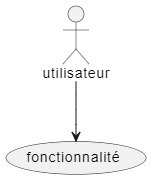
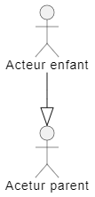
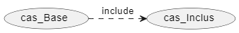
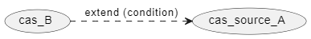
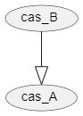
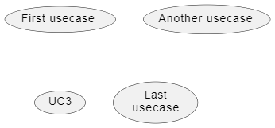
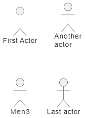

# cour : **Diagramme de cas d’utilisation (aspects fonctionnels)**


## 1. **Definition:**


>Un diagramme de cas d'utilisation est un diagramme UML (Unified Modeling Language) qui permet de modéliser les interactions entre les acteurs (utilisateurs externes ou systèmes) et le système que vous concevez. Il se concentre sur les fonctionnalités du système du point de vue des utilisateurs. 

- **Acetur:**
    - Quelqu’un ou quelque chose qui interagit avec le système
    - Peut être un utilisateur, un paramètre de l’environnement (grandeur physique), ou un autre système

- **Cas d’utilisation:**
    - Manière d’utiliser le système logiciel (représente une fonctionnalité)

- **Relation entre un acteur et un cas d’utilisation:**

    - lorsqu’un acteur peut utiliser une fonctionnalité, il **déclenche** le cas d’utilisation.

exemple en ``PalntUML:``

```
@startuml
usecase fonctionnalité 
actor utilisateur 
utilisateur --> fonctionnalité
@enduml
```





## 2. **Spécialisation d’un acteur:**

>Dans le contexte des diagrammes de cas d'utilisation en UML, la spécialisation d'un acteur se réfère à la création d'une hiérarchie d'acteurs où un acteur général peut être spécialisé en des acteurs plus spécifiques. Cela permet de représenter différentes catégories d'utilisateurs ou d'acteurs avec des fonctionnalités spécifiques. 

- Toute instance de l’acteur enfant est une instance de l’acteur  parent
- Tout ce que peut réaliser l’acteur parent, l’acteur enfant peut le  réaliser

```
@startuml name
:Acteur enfant: as a
:Acetur parent: as b 
a --|> b
@enduml
```




## 3. **Inclusion entre deux cas d’utilisation:**

>L'inclusion entre deux cas d'utilisation est un concept dans les diagrammes de cas d'utilisation en UML . L'inclusion permet de modéliser la réutilisation de comportements communs dans plusieurs cas d'utilisation, ce qui peut simplifier la représentation des interactions entre acteurs et systèmes. Elle est représentée par une flèche avec une flèche pointant vers le cas d'utilisation inclus.


- L'inclusion est utile lorsque plusieurs cas d'utilisation ont des parties communes, et elle permet de simplifier la représentation en évitant la duplication de ces parties communes dans chaque cas d'utilisation. Cela favorise également la maintenance, car toute modification apportée à la partie commune est répercutée dans tous les cas d'utilisation qui l'incluent.


- **Voici un exemple pratique pour illustrer cela :**

    **Cas d'utilisation principal : "Gérer un compte utilisateur"**

    1. L'utilisateur se connecte au système.
    2. Le système affiche le tableau de bord du compte utilisateur.

    Maintenant, supposons qu'il y ait une fonctionnalité commune à plusieurs parties du système, telle que la possibilité de modifier les informations du profil. Plutôt que de répéter cette fonctionnalité dans chaque cas d'utilisation nécessitant une modification de profil, on crée un cas d'utilisation inclus.

    **Cas d'utilisation inclus : "Modifier les informations du profil"**

    1. L'utilisateur sélectionne l'option "Modifier le profil" depuis le tableau de bord du compte utilisateur.
    2. Le système affiche le formulaire de modification du profil.

    Dans ce scénario, le cas d'utilisation inclus ("Modifier les informations du profil") est inclus dans le cas d'utilisation principal ("Gérer un compte utilisateur"). Chaque fois que la modification du profil est nécessaire, le cas d'utilisation principal peut inclure le cas d'utilisation inclus, évitant ainsi la duplication de la logique de modification du profil dans chaque cas d'utilisation qui nécessite cette fonctionnalité.

    Cette relation d'inclusion permet de modéliser de manière efficace la réutilisation de fonctionnalités communes sans avoir à les décrire à plusieurs reprises dans chaque cas d'utilisation. Elle favorise la modularité et la maintenabilité du modèle des cas d'utilisation.

- **Exemple avce ``PlantUML``**

    - Pour réaliser le cas d’utilisation de base, il faut réaliser le cas d’utilisation inclus
    
    - Permet de factoriser des comportements communs

    ```java
    @startuml name 

    usecase cas_Base 
    usecase cas_Inclus

    cas_Base .> cas_Inclus : include

    @enduml
    ```


    


## 4. **Relation d’extension entre deux cas d’utilisation:**

>Cette relation sert à représenter le fait qu'un cas d'utilisation B peut être exécuté en extension d'un cas d'utilisation A, généralement pour traiter des situations particulières ou des fonctionnalités optionnelles.

- L'idée principale est que le cas d'utilisation B n'est pas nécessairement exécuté à chaque fois que le cas d'utilisation A est déclenché, mais seulement dans des circonstances spécifiques. On parle d'extension car le cas d'utilisation B "étend" le flux principal du cas d'utilisation A.


- **Voici un exemple pratique pour illustrer cela :**

    **Cas d'utilisation A : "Effectuer une réservation"**

    1. L'utilisateur sélectionne l'option "Réserver" dans l'interface.
    2. Le système affiche le formulaire de réservation.

    Maintenant, supposons que dans certaines situations, une assurance optionnelle peut être ajoutée à la réservation. On crée donc un cas d'utilisation B en extension du cas d'utilisation A.

    **Cas d'utilisation B : "Ajouter une assurance à la réservation"**

    1. L'utilisateur remplit le formulaire de réservation.
    2. Avant de valider la réservation, l'utilisateur a la possibilité d'ajouter une assurance en cochant une case spécifique.

    Dans ce scénario, le cas d'utilisation B ("Ajouter une assurance à la réservation") est une extension du cas d'utilisation A ("Effectuer une réservation"). Il n'est pas exécuté à chaque fois que quelqu'un effectue une réservation, mais uniquement lorsque l'utilisateur souhaite ajouter une assurance en plus de sa réservation standard.


Cette approche permet de modéliser de manière claire et flexible les fonctionnalités optionnelles ou les cas particuliers qui peuvent survenir pendant l'exécution d'un cas d'utilisation principal.


- **exemple avec ``PlantUML``:**

```java
@startuml name 
usecase cas_source_A
usecase cas_B

cas_B .> cas_source_A : extend (condition)

@enduml

```



## 5. **Généralisation entre deux cas d’utilisation:**

>La relation de généralisation entre deux cas d'utilisation est une manière de modéliser une relation de type "est-un" entre deux cas d'utilisation, où l'un est plus général et l'autre est plus spécifique. Cela signifie que le cas d'utilisation spécialisé (plus spécifique) hérite des caractéristiques et des comportements du cas d'utilisation général (plus général). L'exécution du cas d'utilisation spécialisé est donc une façon d'exécuter le cas d'utilisation plus général.


- **Voici un exemple pratique pour illustrer cela :**

    **Cas d'utilisation général : "Gérer un animal domestique"**

    1. L'utilisateur peut ajouter un nouvel animal domestique au système.
    2. L'utilisateur peut afficher la liste des animaux domestiques enregistrés.
    3. L'utilisateur peut supprimer un animal domestique du système.

    Maintenant, supposons que nous ayons différents types d'animaux domestiques, tels que des chiens et des chats, qui partagent certaines fonctionnalités communes mais ont également des spécificités propres à leur type. On peut alors créer des cas d'utilisation spécialisés.

    **Cas d'utilisation spécialisé : "Gérer un chien" (spécialisation de "Gérer un animal domestique")**

    1. Ajouter un nouveau chien au système (hérité de "Ajouter un nouvel animal domestique").
    2. Afficher la liste des chiens enregistrés (hérité de "Afficher la liste des animaux domestiques").
    3. Supprimer un chien du système (hérité de "Supprimer un animal domestique").

    **Cas d'utilisation spécialisé : "Gérer un chat" (spécialisation de "Gérer un animal domestique")**

    1. Ajouter un nouveau chat au système (hérité de "Ajouter un nouvel animal domestique").
    2. Afficher la liste des chats enregistrés (hérité de "Afficher la liste des animaux domestiques").
    3. Supprimer un chat du système (hérité de "Supprimer un animal domestique").

    Dans cet exemple, "Gérer un chien" et "Gérer un chat" sont des cas d'utilisation spécialisés qui héritent des fonctionnalités générales du cas d'utilisation plus général "Gérer un animal domestique". Ainsi, l'exécution des cas d'utilisation spécialisés revient également à exécuter le cas d'utilisation général correspondant. Cette approche favorise la réutilisation du code et la gestion efficace des fonctionnalités communes et spécifiques.

- **Exemple avce ``PlantUML``:**

```java
@startuml name 
usecase cas_A 
usecase cas_B 
cas_B --|> cas_A 

@enduml
```




## 6. **Diagramme de cas d’utilisation avce PlantUML:**

### 6.1  Cas d'utilisation

- Les cas d'utilisation sont mis entre parenthèses .

- Vous pouvez aussi utiliser le mot-clé **``usecase``** pour définir un cas d'utilisation. Et vous pouvez définir un alias
avec le mot-clé ``as``. Cet alias sera ensuite utilisé lors de la définition des relations.

```java 
@startuml
(First usecase)
(Another usecase) as (UC2)
usecase UC3
usecase (Last\nusecase) as UC4
@enduml
```



### 6.2  Acteurs

- Un Acteur est encadré par des deux points.

- Vous pouvez aussi utiliser le mot-clé **``actor``** pour définir un acteur. 

- Et vous pouvez définir un alias avec le mot-clé ``as``. Cet alias sera ensuite utilisé lors de la définition des relations


```java
@startuml
:First Actor:
:Another\nactor: as Men2
actor Men3
actor :Last actor: as Men4
@enduml
```



### 6.3 Relation entre cas d'utilisation : 

- **Pour extend et include:**

```java
@startuml name 
usecase cas_source_A
usecase cas_B

cas_B .> cas_source_A : extend (condition)

@enduml

```

- **Pour l'heritage:**

```java
@startuml name 
usecase cas_A 
usecase cas_B 
cas_B --|> cas_A 

@enduml
```