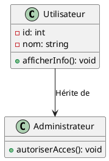

PlantUML est un outil open source qui permet de créer des diagrammes UML (Unified Modeling Language) à l'aide d'une syntaxe textuelle. L'objectif de PlantUML est de fournir un moyen simple de créer des diagrammes UML de manière intuitive en utilisant du texte plutôt que de travailler avec des éditeurs graphiques.

Voici quelques caractéristiques de PlantUML :

1. **Syntaxe textuelle :** Les diagrammes UML sont créés en utilisant une syntaxe textuelle simple et lisible. Par exemple, pour dessiner une classe, il suffit de saisir du texte décrivant les attributs et les méthodes de la classe.

2. **Prise en charge de plusieurs types de diagrammes :** PlantUML prend en charge divers types de diagrammes UML, tels que les diagrammes de classe, de séquence, d'activité, de cas d'utilisation, de composants, et bien d'autres.

3. **Intégration avec différents outils :** PlantUML peut être intégré dans divers environnements et éditeurs de texte. Il peut également être utilisé avec des outils de génération automatique de documentation.

4. **Sortie en plusieurs formats :** Les diagrammes créés avec PlantUML peuvent être exportés dans différents formats, tels que PNG, SVG, PDF, etc.

5. **Open source :** PlantUML est open source et est distribué sous la licence GNU General Public License (GPL).

Voici un exemple simple de syntaxe PlantUML pour un diagramme de classe :

Cet exemple générerait un diagramme de classe représentant une relation d'héritage entre les classes `Utilisateur` et `Administrateur`.

Pour utiliser PlantUML, vous pouvez utiliser son propre site web (http://www.plantuml.com/plantuml/), ou intégrer l'outil dans votre flux de travail de développement en utilisant des extensions pour des éditeurs de texte, des plugins pour des outils de documentation, ou en utilisant la ligne de commande avec l'outil en ligne de commande PlantUML.

## RQ : 

[site officielle de plantuml](https://plantuml.com/fr/)