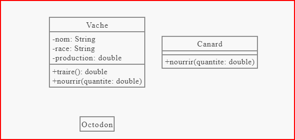
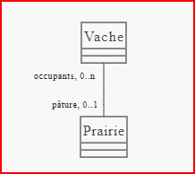
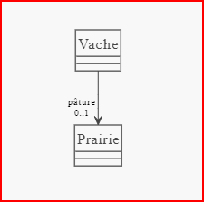
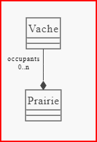
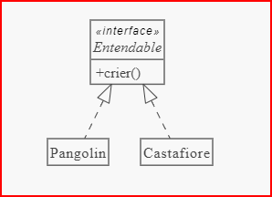

# cour 02 : Diagramme de calsses 

## 1. Définition :

- **Diagramme de Classes :** 
    
    - Représente les classes du système, leurs attributs, leurs relations et leurs méthodes. Il permet de visualiser la structure statique du système.

    -  est l'un des diagrammes les plus couramment utilisés pour représenter la structure statique d'un système logiciel. 
    
    - Il illustre : 
        * les classes, 
        * les interfaces, 
        * les attributs, 
        * les méthodes, 
        * les relations 
        * et les différents types d'associations entre les entités.

## 2. **Classes :**

- Les classes sont représentées sous leur forme la plus détaillée par un tableau en trois parties :

    - nom de la classe
    
    - liste des attributs (avec leur type)
    
    - liste des méthodes (avec leur signature).
    
    - Le signe ``+/-/#``  est la visibilité, respectivement ``public``, ``private`` ou ``protected``. 

- **Exemple :**

## 3. **Associations :**

### 3.1 Définition : 

- une association représente la relation entre deux classes ou plus dans un diagramme de classes. 

- Ces associations décrivent comment les objets de différentes classes sont liés les uns aux autres. 

- Elles montrent comment les instances des classes interagissent et communiquent dans un système logiciel.

- Éléments clés des associations en UML :

    1. **Cardinalité :** La cardinalité d'une association définit le nombre d'objets d'une classe qui peuvent être liés à un nombre d'objets d'une autre classe. Elle est représentée par des chiffres ou des symboles sur les lignes d'association.

    2. **Rôles :** Les rôles définissent le comportement de chaque classe dans l'association. Par exemple, dans une relation entre les classes "Employé" et "Département", l'employé peut jouer le rôle d'employé et le département peut jouer le rôle de département.

### 3.2 Types d'associations :

- **Association simple :**

    - une association simple en UML fait référence à une relation de base entre deux classes. 

    - Une association simple représente un lien entre deux classes, indiquant qu'une instance d'une classe peut être liée à une ou plusieurs instances d'une autre classe, ou à une instance unique de cette autre classe.

    - **Exemple :**

    

    - **Traduction :**
        
        - Il y a dans la classe Vache, un attribut nommé ``pâture`` de type ``Prairie``, dont la valeur peut être null (multiplicité 0..1). 
        
        - Réciproquement, il y a  dans la classe ``Prairie``  un attribut nommé ``occupants`` de type tableau de ``Vache`` .
        
        - Une prairie est associée à un nombre de vaches allant de 0 à n.

- **Association directionnelle :**

    - Une association directionnelle en UML se réfère à une relation entre deux classes où le lien ou la connexion est établi dans une direction spécifique. 

    - **Exemple :**

        
    
    - **Traduction :**

        - Il y a dans la classe ``Vache``  un attribut nommé pâture de type ``Prairie``  dont la valeur peut être null (multiplicité 0..1).
        
        - Par contre, la classe ``Prairie`` n'a pas d'attribut de type Vache. 
        
        - Ainsi  « une vache sait dans quelle prairie elle se trouve », mais « une prairie ne sait pas quelle(s) vache(s) elle accueille ».

    
 
- **Agrégation:**

    - **L'agrégation** est une relation  entre des objets, où un objet est composé de plusieurs autres objets, mais ces objets peuvent exister indépendamment de l'objet principal. 
    
    - L'agrégation est représentée par un losange creux à une extrémité de la ligne qui relie les classes.

    - L'objet principal possède une référence vers l'objet agrégé.
    
    - Les objets agrégés peuvent exister indépendamment de l'objet principal.

    - **Exemple :**

        

    - **Traduction :**

        - Une ``Prairie`` connaît les vaches qu'elle accueille, elle possède un attribut nommé occupants de type tableau (ou collection) de Vache. 

        - Par contre, les vaches ne savent pas forcément dans quelle prairie elles se trouvent. 

        - Elles peuvent aussi ne pas être dans une prairie , une instance de ``Vache`` peut exister même si elle n'est associée à aucune ``Prairie``.

- **Composition :**

    - La composition est une forme spécifique d'agrégation dans laquelle l'objet agrégé est une partie constitutive de l'objet principal. 
    
    - Si l'objet principal cesse d'exister, les objets composants cessent également d'exister.
    
    - La composition est représentée par un losange plein à une extrémité de la ligne qui relie les classes.

    - L'objet principal est responsable de la création et de la destruction des objets composants.
    
    - Les objets composants sont des parties intégrantes de l'objet principal.

    - **Exemple :**

        

    - **Traduction :**

        - une ``Prairie`` connaît les vaches qu'elle accueille. 
        
        - Par contre une composition (losange plein) signifie qu'une vache est toujours dans une et une seule prairie. 
        
        - La classe Prairie est « propriétaire » des instances de Vache qui la composent; si la prairie est détruite, ses vaches le sont également.

## 4. **Héritage :**

- **Définition :**

    - L'héritage en UML est un concept clé de la programmation orientée objet qui permet à une classe (appelée sous-classe ou classe dérivée) de hériter des attributs et des méthodes d'une autre classe (appelée super-classe ou classe de base). 

    - En UML, l'héritage est représenté visuellement dans les diagrammes de classes pour décrire la relation "est-un".

- Principes de l'héritage en UML :

    1. **Classe de Base (Super-classe) :** Une classe existante dont les attributs et les méthodes peuvent être hérités par d'autres classes.
    
    2. **Classe Dérivée (Sous-classe) :** Une classe qui hérite des attributs et des méthodes d'une classe de base. Elle peut ajouter de nouveaux attributs et méthodes spécifiques à son propre contexte.

- **Exemple :**

## 5. **Interface :**

- **Définition :**

    - une interface représente un type abstrait qui spécifie un ensemble de méthodes publiques que les classes concrètes doivent implémenter. 

- **Exemple :**

