# cour : 

## 1. **Classe, objet et association:**

### 1.1 **classe:**

- **Definition:classe**
    
    >Une classe est une abstraction qui represente un ensemble d’objets de meme nature , Une classe comporte un nom, des attributs et des operations.

- **Exemple:**

    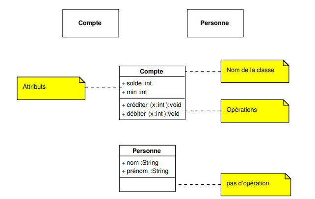

- **``attributs``:**

    - **Definition:**
        
        >Un attribut est une propriete d’un objet de la classe , Il comporte un nom et  un type et eventuellement une valeur initiale

 

    - Un ``attribut derive`` est un attribut dont la valeur peut etre calculee à partir des attributs non dérivés

        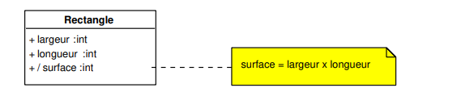

    - Un ``attribut de classe`` est un attribut qui est partagé par toutes les instances de la classe

- **``operations:``**

    >Les opérations peuvent comporter des paramétres (qui peuvent etre types et comporter une valeur initiale) et un resultat

- **Classe utilitaire**
        
    >Une classe utilitaire permet de regrouper un ensemble de valeurs (valeurs d’attributs) et d’operations. Une classe utilitaire ne peut pas etre instanciee, et ne comporte que des attributs et des operations de classe.

    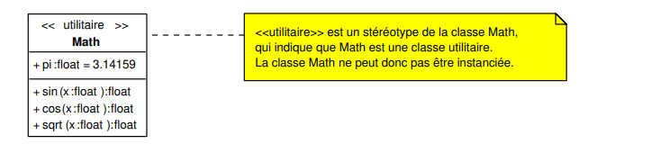

### 1.2 **Objet:**

- **Definition:**

    >Une classe est une abstraction qui represente un ensemble ``d’objets``. Chaque ``objet`` est une ``instance`` d’une classe.

    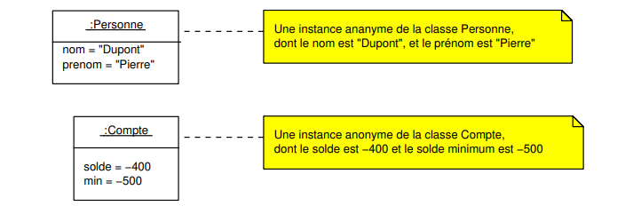

- **Niveaux de visibilite:**

    >Il y a quatre niveaux de visibilitee en UML pour les attributs et les operations .

    
    - le niveau public (+), qui indique qu’un élément est visible pour tous les clients de la classe ;

    - le niveau protege (#), qui indique qu’un element est accessible uniquement pour les sous-classes de la classe ou il apparaıt ;

    - le niveau paquetage (~), qui indique qu’un element est visible uniquement pour les classes definies dans le meme paquetage ;

    - le niveau privé (-), qui indique que seule la classe ou est défini cet élément peut y acceder

### 1.3 **association:**

- **Definition:**
    
    >Une association est, de façon générale, une relation n-aire entre n classes d’objets. Les relations les plus utilisées sont les relations binaires, entre deux classes.

    >Une association entre les classes A et B est une relation binaire, au sens mathématique, autrement dit un sous-ensemble de A × B. Cela signifie qu’il existe au plus un lien entre un objet de la classe A et un objet de la classe B

- **Exemple:**

    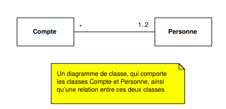

    - **signification des multiplicités,:**
        - ``*:`` signifie qu’une personne peut ouvrir un nombre quelconque de comptes ;
        - ``1..2`` signifie qu’un compte est ouvert pour une ou deux personnes

    - **Un diagramme d’objets correspondant au diagramme de classes:**

        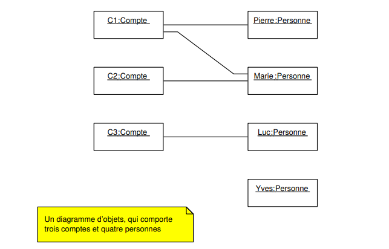

- **``Navigabilité``:**

    - **Definition:**

        >la navigabilité fait référence à la capacité d'un objet dans une classe à accéder aux objets d'une autre classe via une relation d'association. Elle spécifie la direction dans laquelle la navigation est possible entre les classes liées par une relation.

    
    - **Il existe deux types de navigabilité :**

        - **Navigabilité unidirectionnelle :** Un objet peut naviguer vers un autre objet, mais pas nécessairement dans l'autre sens. Cela signifie que la relation est spécifiée dans une seule direction.

            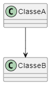
        
        - **Navigabilité bidirectionnelle :** Les deux objets impliqués dans la relation peuvent naviguer l'un vers l'autre. Cela signifie que la relation permet la navigation dans les deux sens.

            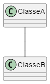

    

- **``Rôles:``**

    >les rôles dans une association sont des spécifications qui décrivent le comportement ou la signification particulière de chaque extrémité de l'association entre les classes. Chaque extrémité de l'association est associée à un rôle qui donne un contexte sémantique à cette extrémité.

    - **Exemple:**

        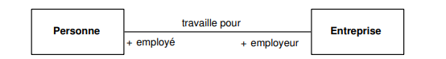

        - **Rôle de l'employé (côté Personne) :** C'est le rôle joué par la classe des personnes. Une personne qui est liée par cette association joue le rôle d'un employé. 

        - **Rôle de l'employeur (côté Entreprise) :** C'est le rôle joué par la classe des entreprises. Une entreprise qui est liée par cette association joue le rôle d'un employeur. 

- **``Multiplicités``:**

    >Une multiplicit´é est un sous-ensemble de N.Les notations utilisées en UML pour décrire des multiplicités sont les suivantes :

    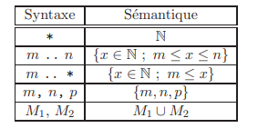

    -  
    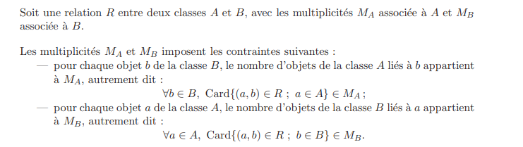

- **``Associations particulières``:**

    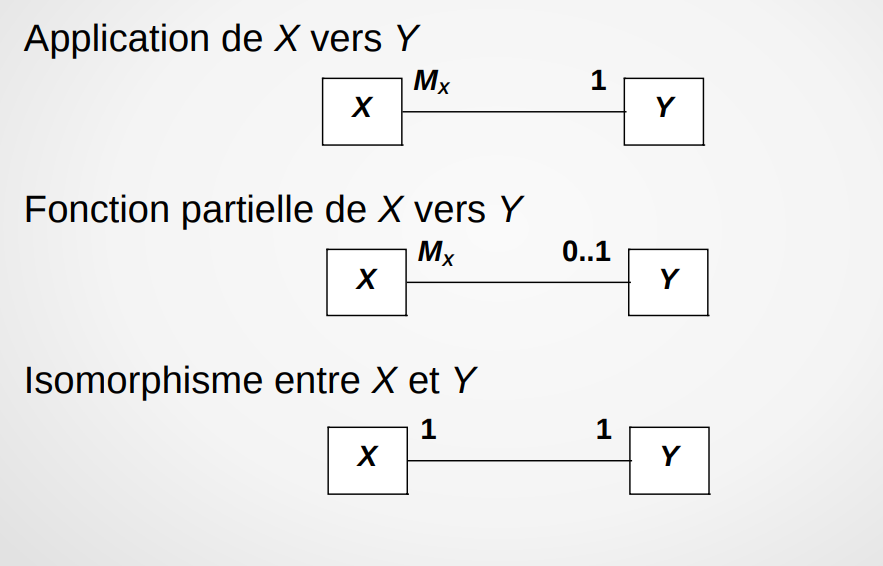

## 2. Classes associatives:

>Une classe associative est une classe qui est associée à une relation particulière entre deux ou plusieurs autres classes. Elle est utilisée pour représenter des informations spécifiques à cette relation.

>En UML, une classe associative est généralement représentée par une classe située entre les classes liées par l'association. Elle peut contenir des attributs qui décrivent les caractéristiques propres à cette association. Cette approche permet de modéliser des informations supplémentaires liées à la relation elle-même.

- **Exemple:**

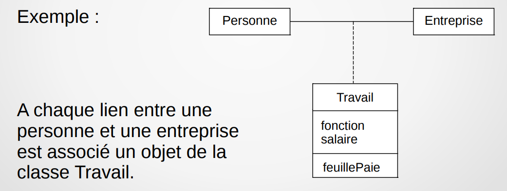

## 3. 

 l'agrégation est une relation entre deux classes, indiquant qu'une classe est un tout et peut être composée de plusieurs parties. C'est une forme de relation de composition moins contraignante. Elle est représentée par une ligne avec un losange vide du côté du "tout" et une flèche pointant vers le "tout".

L'agrégation est utilisée pour exprimer une relation de tout à partie où la partie peut exister indépendamment du tout. En d'autres termes, la destruction de la classe tout ne nécessite pas nécessairement la destruction de la classe partie.

Voici un exemple pour illustrer l'agrégation en UML :

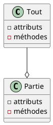

Dans cet exemple, `Tout` est la classe tout et `Partie` est la classe partie. La ligne avec un losange vide (`o`) du côté de `Tout` indique une relation d'agrégation. Cela signifie que `Tout` peut être composé de plusieurs instances de `Partie`, mais la destruction de `Tout` ne détruit pas automatiquement les instances de `Partie`.

En résumé, l'agrégation en UML modélise une relation de tout à partie où les parties peuvent exister indépendamment du tout. Elle est moins contraignante que la composition, où la destruction du tout entraîne la destruction des parties.

